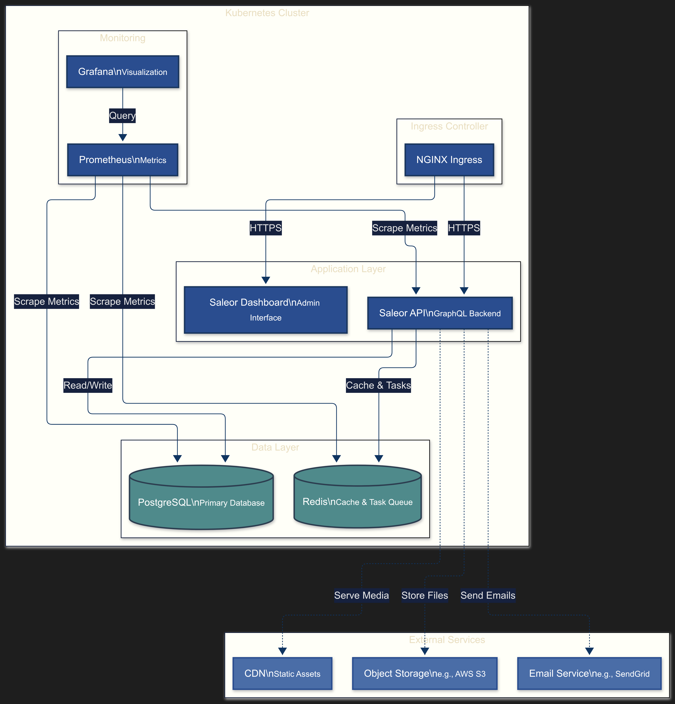
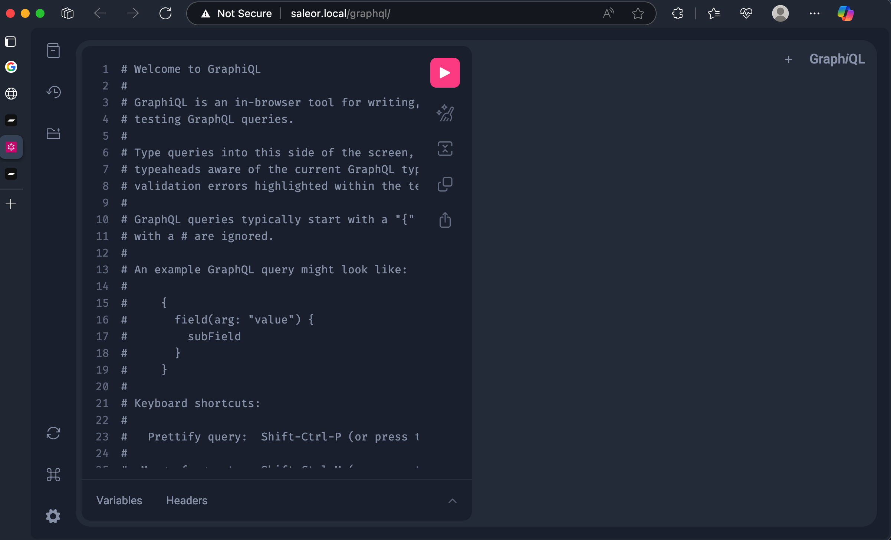
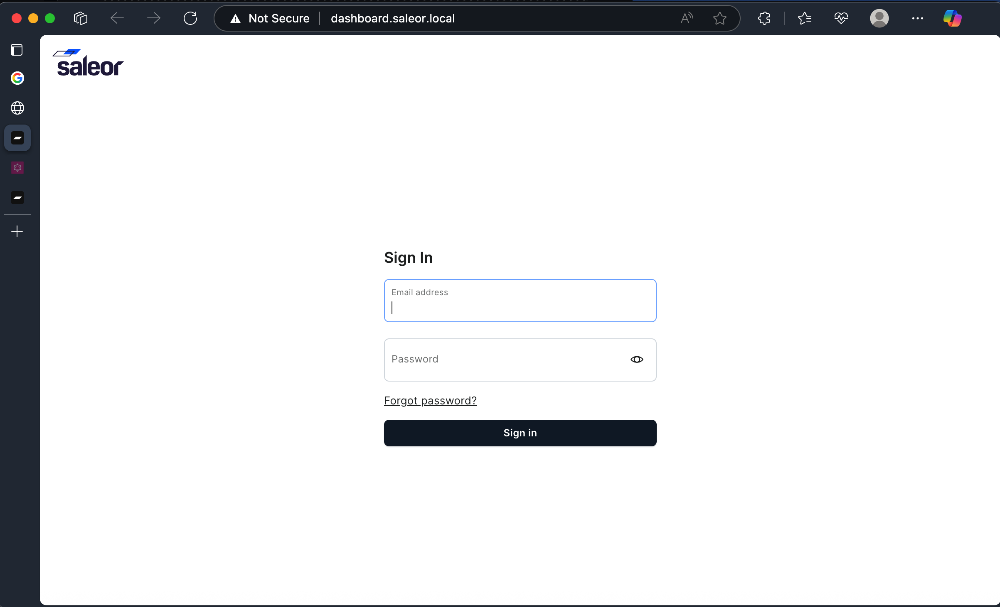
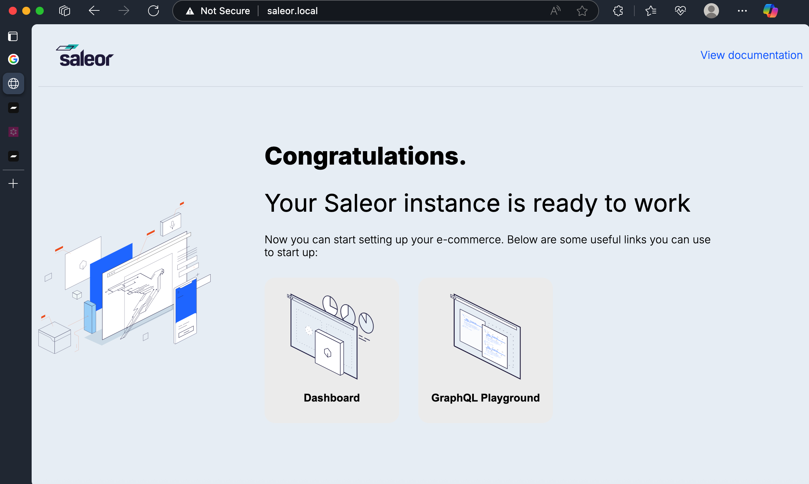

# Saleor E-commerce Platform on Kubernetes

[](https://hub.docker.com/u/matthewntsiful)
[](https://kubernetes.io/)
[](https://saleor.io/)
[](LICENSE)
[]()

A production-ready deployment of [Saleor](https://saleor.io/) - a headless, GraphQL-native e-commerce platform - on Kubernetes with complete infrastructure setup.

## 📦 Custom Docker Images

This deployment uses custom-built Docker images based on the original Saleor project:

- **Original Project**: Cloned from [Saleor Official Repository](https://github.com/saleor/saleor)
- **Custom Images**: Built and pushed to [Docker Hub](https://hub.docker.com/u/matthewntsiful)
  - `matthewntsiful/saleor-webapp:latest` - Main Saleor API application
  - `matthewntsiful/saleor-dashboard:latest` - Admin dashboard interface

### Image Build Process
```bash
# Images were built from the original Saleor source
git clone https://github.com/saleor/saleor.git
cd saleor

# Built and pushed custom images
docker build -t matthewntsiful/saleor-webapp:latest .
docker push matthewntsiful/saleor-webapp:latest

docker build -t matthewntsiful/saleor-dashboard:latest -f Dockerfile.dashboard .
docker push matthewntsiful/saleor-dashboard:latest
```

## 🏗️ Architecture Overview

This project deploys a complete e-commerce platform with the following components:

### System Architecture


*High-level architecture of the Saleor e-commerce platform on Kubernetes*

*The above diagram is also available in [Mermaid format](assets/architecture-diagram.mmd) for editing.*

### CI/CD Pipeline

```mermaid
%%{init: {'theme': 'base', 'themeVariables': { 'primaryColor': '#1a1a2e', 'primaryTextColor': '#e6e6e6', 'primaryBorderColor': '#16213e', 'lineColor': '#0f3460', 'secondaryColor': '#16213e', 'tertiaryColor': '#16213e'}}}%%
graph LR
    subgraph "Version Control"
        GitHub["GitHub Repository\n<small>Source Code</small>"]
    end
    
    subgraph "CI/CD Pipeline"
        Build[Build & Test\n<small>Docker Images</small>]
        Test[Run Tests\n<small>Unit & Integration</small>]
        Scan[Security Scan\n<small>Vulnerability Check</small>]
        DeployDev[Deploy to Dev\n<small>Kubernetes</small>]
        TestE2E[E2E Tests\n<small>Smoke & Regression</small>]
        DeployProd[Deploy to Production\n<small>Kubernetes</small>]
        Monitor[Monitor\n<small>Application Health</small>]
    end
    
    subgraph "Container Registry"
        DockerHub["Docker Hub\n<small>matthewntsiful/*</small>"]
    end
    
    subgraph "Environments"
        K8sDev["Development\n<small>Kubernetes Cluster</small>"]
        K8sProd["Production\n<small>Kubernetes Cluster</small>"]
    end
    
    subgraph "Monitoring"
        Logs["Logs\n<small>ELK Stack</small>"]
        Metrics["Metrics\n<small>Prometheus</small>"]
        Alerts["Alerts\n<small>AlertManager</small>"]
    end
    
    %% Pipeline Flow
    GitHub -->|On Push/PR| Build
    Build -->|On Success| Test
    Test -->|On Success| Scan
    Scan -->|On Success| DockerHub
    DockerHub -->|Image Ready| DeployDev
    DeployDev -->|Deployed| TestE2E
    TestE2E -->|Tests Pass| DeployProd
    DeployProd -->|Deployed| Monitor
    
    %% Monitoring Connections
    K8sDev -->|Logs & Metrics| Logs
    K8sDev -->|Metrics| Metrics
    K8sProd -->|Logs & Metrics| Logs
    K8sProd -->|Metrics| Metrics
    Metrics -->|Alerts| Alerts
    
    %% Styling
    classDef pipeline fill:#2a4d8f,stroke:#1a365d,color:white,stroke-width:2px
    classDef infra fill:#4f8a8b,stroke:#2c3e50,color:white,stroke-width:2px
    classDef monitoring fill:#4a6da7,stroke:#2a4d8f,color:white,stroke-width:2px
    
    class Build,Test,Scan,DeployDev,TestE2E,DeployProd,Monitor pipeline
    class GitHub,DockerHub,K8sDev,K8sProd infra
    class Logs,Metrics,Alerts monitoring
```



### Key Components

- **Saleor API** - Django-based GraphQL e-commerce backend
- **Saleor Dashboard** - React-based admin interface
- **PostgreSQL** - Primary database with persistent storage
- **Redis** - Caching and Celery task queue
- **Nginx Ingress** - Load balancing and external access
- **Monitoring** - Prometheus and Grafana for metrics and visualization

## 🚀 Features

### ✅ Production-Ready Configuration
- **Resource limits** and requests for all containers
- **Health probes** (liveness and readiness) for automatic recovery
- **Persistent storage** for database data
- **Secrets management** for sensitive configuration
- **Init containers** for database migrations
- **Horizontal scaling** support

### ✅ Security Best Practices
- Separate ConfigMaps and Secrets
- Non-root container execution
- Network policies ready
- Secure credential handling

### ✅ High Availability
- Multiple replicas for API pods
- Persistent data storage
- Automatic pod restart on failures
- Load balancing via Kubernetes services

## 📁 Project Structure

```
saleor-k8s-deployment/
├── README.md                    # This file
├── .github/workflows/          # CI/CD Pipeline
│   └── ci-cd.yml               # GitHub Actions workflow
├── saleor-webapp/              # Saleor application source code
│   ├── saleor/                 # Django application
│   ├── templates/              # HTML templates
│   ├── Dockerfile              # API container build
│   ├── manage.py               # Django management
│   ├── pyproject.toml          # Python dependencies
│   └── ...                     # Other source files
├── k8s-manifests/              # Kubernetes YAML files
│   ├── 01-namespace.yaml       # Namespace isolation
│   ├── 02-secret.yaml          # Sensitive configuration
│   ├── 03-configmap.yaml       # Application configuration
│   ├── 04-postgres-pvc.yaml    # Persistent storage claim
│   ├── 05-postgres.yaml        # PostgreSQL database
│   ├── 06-redis.yaml           # Redis cache/queue
│   ├── 07-saleor-deployment.yaml # Main Saleor API
│   ├── 08-ingress.yaml         # API external access
│   ├── 09-dashboard-deployment.yaml # Admin dashboard
│   └── 10-dashboard-ingress.yaml   # Dashboard external access
├── screenshots/                # Application screenshots
│   ├── application.png         # Complete platform overview
│   ├── dashboard.png           # Admin dashboard interface
│   └── graphql-playground.png  # GraphQL API playground
├── scripts/
│   └── deploy.sh               # Automated deployment script
└── docs/
    └── DEPLOYMENT.md           # Detailed deployment guide
```

## 🛠️ Prerequisites

- **Kubernetes cluster** (minikube, kind, or cloud provider)
- **kubectl** configured and connected to your cluster
- **Nginx Ingress Controller** installed
- **Docker** (for building custom images)

### Install Nginx Ingress Controller
```bash
# For minikube
minikube addons enable ingress

# For other clusters
kubectl apply -f https://raw.githubusercontent.com/kubernetes/ingress-nginx/controller-v1.8.1/deploy/static/provider/cloud/deploy.yaml
```

## 🚀 Quick Start

### 1. Clone and Deploy
```bash
git clone <your-repo-url>
cd saleor-k8s-deployment

# Make deployment script executable
chmod +x scripts/deploy.sh

# Deploy everything
./scripts/deploy.sh
```

### 2. Configure Local Access
Add these entries to your `/etc/hosts` file:
```bash
127.0.0.1 saleor.local
127.0.0.1 dashboard.saleor.local
```

### 3. Access the Platform
- **API & GraphQL Playground**: http://saleor.local
- **Admin Dashboard**: http://dashboard.saleor.local

## 🚀 CI/CD Pipeline

Automated GitHub Actions workflow for building and deploying Saleor:

### Pipeline Features
- **Build**: Builds Docker images from source code in `saleor-webapp/`
- **Security Scan**: Trivy vulnerability scanning with SARIF upload
- **Push**: Pushes images to GitHub Container Registry (GHCR)
- **Deploy**: Automatic deployment to Kubernetes on main branch
- **Test**: Comprehensive application testing in KinD cluster
  - Health endpoint verification
  - GraphQL API functionality test
  - Dashboard accessibility check
- **Verification**: Health checks and rollout status validation
- **Manual Trigger**: Supports workflow_dispatch for manual deployments

### Required Secrets
No external secrets needed for testing - uses KinD cluster in CI.

For production deployment to external cluster:
```bash
KUBE_CONFIG        # Base64 encoded kubeconfig file (optional)
```

### Required Variables
Configure these variables in your GitHub repository:

```bash
KUBERNETES_NAMESPACE # Kubernetes namespace
```

### Automatic Configuration
- **GITHUB_TOKEN**: Automatically provided by GitHub Actions
- **Images**: Automatically tagged as `ghcr.io/username/saleor-webapp`

### Setup Instructions
```bash
# Encode kubeconfig for GitHub secret
cat ~/.kube/config | base64 -w 0

# Add to GitHub repository secrets as KUBE_CONFIG
```

## 📸 Screenshots

### Saleor API & GraphQL Playground

*GraphQL Playground interface for API testing and exploration*

### Admin Dashboard

*React-based admin interface for managing the e-commerce platform*

### Application Overview

*Complete Saleor e-commerce platform running on Kubernetes*

## 🔧 Configuration

### Environment Variables
Key configuration is managed through ConfigMaps and Secrets:

**ConfigMap (Non-sensitive)**:
- `CELERY_BROKER_URL` - Redis connection for task queue
- `ALLOWED_HOSTS` - Allowed hostnames
- `DASHBOARD_URL` - Dashboard location

**Secret (Sensitive)**:
- `SECRET_KEY` - Django secret key
- `DATABASE_URL` - PostgreSQL connection string

### Resource Allocation
| Component | CPU Request | Memory Request | CPU Limit | Memory Limit |
|-----------|-------------|----------------|-----------|--------------|
| Saleor API | 250m | 1Gi | 1000m | 2Gi |
| PostgreSQL | 200m | 512Mi | 500m | 1Gi |
| Redis | 50m | 128Mi | 100m | 256Mi |
| Dashboard | 100m | 128Mi | 200m | 256Mi |

## 📊 Monitoring & Health Checks

### Health Probes
- **Saleor API**: HTTP probe on `/health/` endpoint
- **PostgreSQL**: `pg_isready` command execution
- **Redis**: `redis-cli ping` command execution
- **Dashboard**: HTTP probe on root path

### Monitoring Endpoints
- **GraphQL Playground**: `http://saleor.local/graphql/`
- **Health Check**: `http://saleor.local/health/`

## 🔄 Scaling

### Horizontal Scaling
```bash
# Scale Saleor API pods
kubectl scale deployment saleor -n saleor --replicas=3

# Scale Dashboard pods
kubectl scale deployment saleor-dashboard -n saleor --replicas=2
```

### Vertical Scaling
Update resource limits in the respective YAML files and apply:
```bash
kubectl apply -f k8s-manifests/07-saleor-deployment.yaml
```

## 🛡️ Security Considerations

### Production Recommendations
1. **Update default passwords** in `02-secret.yaml`
2. **Use strong SECRET_KEY** (generate with Django)
3. **Enable TLS/SSL** for ingress
4. **Implement network policies**
5. **Use managed databases** for production
6. **Enable pod security policies**

### Secret Management
```bash
# Generate strong secret key
python -c "import secrets, base64; key=secrets.token_urlsafe(50); print(base64.b64encode(key.encode()).decode())"

# Update secret
kubectl create secret generic saleor-secret \
  --from-literal=SECRET_KEY=<your-key> \
  --from-literal=DATABASE_URL=<your-db-url> \
  -n saleor --dry-run=client -o yaml | kubectl apply -f -
```

## 🚨 Troubleshooting

### Common Issues

**Pods not starting**:
```bash
kubectl get pods -n saleor
kubectl describe pod <pod-name> -n saleor
kubectl logs <pod-name> -n saleor
```

**Database connection issues**:
```bash
kubectl logs -n saleor deployment/saleor -c migrate
kubectl exec -it -n saleor deployment/postgres -- psql -U saleor -d saleor
```

**Ingress not working**:
```bash
kubectl get ingress -n saleor
kubectl describe ingress saleor-ingress -n saleor
```

### Manual Migration
If init container fails:
```bash
kubectl exec -it -n saleor deployment/saleor -- python manage.py migrate
```

## 🔄 Updates & Maintenance

### Update Application
```bash
# Update image tag in deployment
kubectl set image deployment/saleor saleor=matthewntsiful/saleor-webapp:v2.0 -n saleor

# Or edit and apply
kubectl apply -f k8s-manifests/07-saleor-deployment.yaml
```

### Backup Database
```bash
kubectl exec -n saleor deployment/postgres -- pg_dump -U saleor saleor > backup.sql
```

## 🏭 Production Deployment

### Cloud Provider Setup
For production deployment, consider:

1. **Managed Kubernetes** (EKS, GKE, AKS)
2. **Managed Database** (RDS, Cloud SQL, Azure Database)
3. **Managed Redis** (ElastiCache, Cloud Memorystore)
4. **Cloud Storage** (S3, GCS, Azure Blob)
5. **Load Balancer** (ALB, Cloud Load Balancer)
6. **SSL Certificates** (Let's Encrypt, Cloud SSL)

### Environment-Specific Configs
Create separate configurations for:
- Development (`dev/`)
- Staging (`staging/`)
- Production (`prod/`)

## 📚 Additional Resources

- [Saleor Documentation](https://docs.saleor.io/)
- [Saleor GitHub Repository](https://github.com/saleor/saleor)
- [Kubernetes Documentation](https://kubernetes.io/docs/)
- [Nginx Ingress Controller](https://kubernetes.github.io/ingress-nginx/)

## 🤝 Contributing

1. Fork the repository
2. Create a feature branch
3. Make your changes
4. Test the deployment
5. Submit a pull request

## 📄 License

This project is licensed under the MIT License - see the original [Saleor License](https://github.com/saleor/saleor/blob/main/LICENSE) for details.

## 👨‍💻 Author

**Matthieu Ntsiful**
- Kubernetes deployment and infrastructure setup
- Production-ready configuration and security hardening
- Automated deployment scripts and documentation

---

*Built with ❤️ for modern e-commerce deployments*